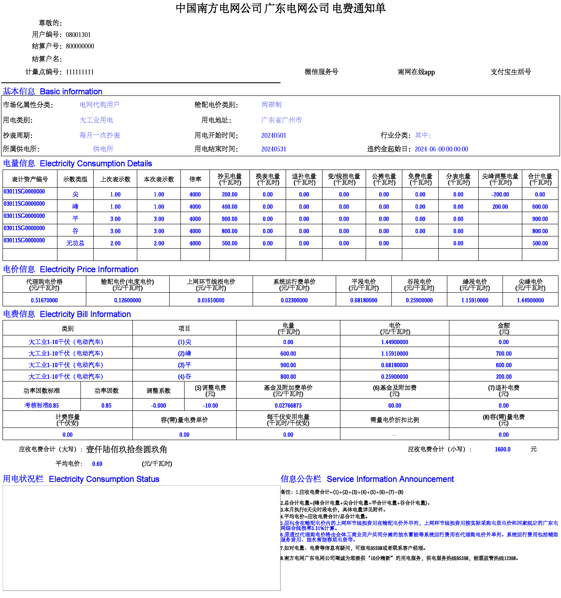

# CSG-Bill-Reader: 中国南方电网PDF电费通知单(账单)数据提取

## 功能

读取文件夹下全部中国南方电网PDF电费通知单，以CSV格式保存电费通知单数据和有功总合计电量数据。

## 使用方法

1. 确保已安装 [Python](https://www.python.org/)>=3.10 和 [pypdf](https://pypdf.readthedocs.io/)==5.0.1、[pandas](https://pandas.pydata.org/)，后两者可通过 `pip install pypdf==5.0.1 pandas` 安装。
2. 下载 [`reader.py`](reader.py) 至电费通知单所在文件夹下，运行 `reader.py`。

## 已知问题

由于使用pypdf和正则表达式匹配文本和表格，若pypdf版本更新或电费单细节更新，可能会无法匹配。

## 电费通知单(账单)适用版本

